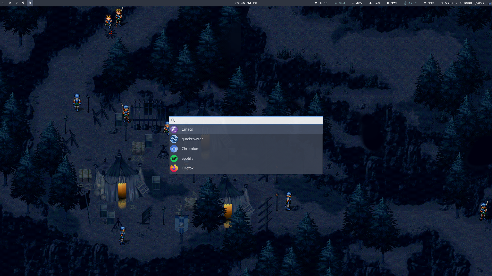

<p align="center"></p>
<p align="center">
  <a href="https://www.archlinux.org/"></a>
  <a href="https://www.gnu.org/software/stow/"></a>
</p>
<p align="center">This repository contains all of my dotfiles configuration.</p>

---

List of files:

```
 bash            ➔ bash settings, aliases, and custom prompts
 bin             ➔ various useful scripts (borg, rofi, etc)
 dunst           ➔ lightweight replacement for the notification-daemons
 git             ➔ global git config and aliases
 gnupg           ➔ allows you to encrypt and sign your data and communication
 i3              ➔ dynamic tiling window manager for X11 inspired by wmii
 mbsync          ➔ capable of synchronizing mail on IMAP server with local Maildir folder
 neofetch        ➔ CLI system information tool
 newsboat        ➔ RSS/Atom feed reader for text terminals
 polybar         ➔ status bars
 ranger          ➔ console file manager with VI key bindings
 sway            ➔ i3-compatible Wayland compositor
 systemd         ➔ systemd units
 termite         ➔ keyboard-centric VTE-based terminal
 x11             ➔ X11 settings
 zsh             ➔ zshell settings, aliases, and custom prompts
```

However, it is still possible to access my [old dotfiles](https://github.com/rememberYou/old-dotfiles) that I no longer use, in
case they can help you.

## Quick preview

A non-exhaustive preview of the environment I use on a daily basis.

Last Updated: **05 May, 2018**.

Note: you can find my wallpapers [here](https://github.com/rememberYou/wallpapers).




## Dotfiles Manager

I'm using [GNU Stow](https://www.gnu.org/software/stow/) a free, lightweight
dotfiles manager written in Perl to manages my dotfiles.

What's make differentiates it from other dotfiles managers is that it does
not require various Python, Ruby or Perl dependencies like most dotfiles
manager.

With that, it is easy to share files among multiple users or computers with a
few command lines.

## Getting Started

No matter what your Linux distribution, `stow` can easily be installed according
to your package manager:

	sudo pacman -S stow
	sudo apt-get install stow

For macOS users:

	brew install stow

Once the installation is complete, make a clone of the repository:

	git clone https://github.com/rememberYou/dotfiles.git

You can now install any configurations you wish to copy using GNU Stow:

```bash
# Make sure you are in the right directory
cd dotfiles

# Example to install the sway config
stow sway

# Uninstall the sway config
stow -D sway
```

If you want to install all the configurations, you can do it directly
with
[`stowsym.sh`](https://github.com/rememberYou/dotfiles/blob/master/stowsym.sh):

```bash
# Change permission to execute the script
chmod +x stowsym.sh

# Installation of configuration files
./stowsym.sh -i

# Deletion of configuration files
./stowsym.sh -d
```

Easy, isn't it? For those who want to find my Emacs configuration files, they
are available: [here](https://github.com/rememberYou/.emacs.d/).

## TODO

Here is a list of tasks I plan to do in my spare time to improve this
configuration:

*  Refactoring my `sway` configuration.

## Contributions

Various functions may be optimized or spelling errors may occur. If you want to
make your own correction on these dotfiles, you are free to do so.

Please note that I can't guarantee that your changes will be accepted.

## License

The code is unlicensed, take what you like and hope that these dotfiles can be
so useful to you that it is for me.
