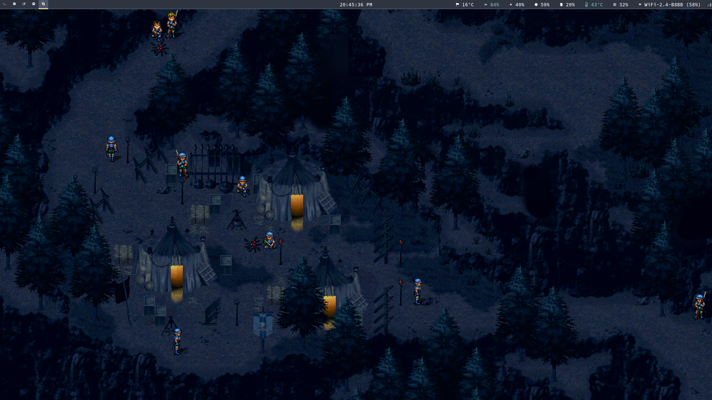

<p align="center"></p>
<p align="center">
  <a href="https://www.archlinux.org/"></a>
  <a href="https://www.gnu.org/software/stow/"></a>
</p>
<p align="center">This repository contains all of my dotfiles configuration.</p>

---

These dotfiles allow me to make my daily life easier by saving me time
and easily meeting my needs.

I try to keep these dotfiles tidy and up to date. I invite you to take
a look at it to get different ideas for your dotfiles and why not
leave comments, suggestions, questions and bug reports if something
seems odd to you.

Finally, this repository has
[wiki](https://github.com/rememberYou/dotfiles/wiki)
pages to better understand some of the choices I have made and allow
me to answer any questions you may have have about these
dotfiles. Feel free to visit them ☺

List of files:

```
 alacritty       ➔ cross-platform, GPU-accelerated terminal emulator
 bash            ➔ bash settings, aliases, and custom prompts
 bin             ➔ various useful scripts (e.g. borg, rofi)
 git             ➔ global git config and aliases
 gnupg           ➔ allows you to encrypt and sign your data and communication
 htop            ➔ interactive process viewer
 isync           ➔ capable of synchronizing mail on IMAP server with local Maildir folder
 lf              ➔ terminal file manager
 mpd             ➔ music player daemon
 mpv             ➔ media player based on MPlayer and the now unmaintained mplayer2
 ncmpcpp         ➔ mpd client
 neofetch        ➔ CLI system information tool
 newsboat        ➔ RSS/Atom feed reader for text terminals
 python          ➔ specific to Python
 qutebrowser     ➔ keyboard-focused browser with a minimal GUI
 sh              ➔ common to all shells (e.g. aliases, environment variables)
 ssh             ➔ SSH settings
 sway            ➔ i3-compatible Wayland compositor
 systemd         ➔ systemd units
 tmux            ➔ terminal multiplexer
 waybar          ➔ Wayland bar for Sway and Wlroots based compositors
 wofi            ➔ window switcher, application launcher, ssh dialog for wlroots compositors
 x11             ➔ X11 settings
 zsh             ➔ zshell settings, aliases, and custom prompts
```

**NOTE:** it is still possible to access my [old
dotfiles](https://github.com/rememberYou/old-dotfiles) that I no
longer use, in case they can help you.

## Structure

I structured my dotfiles so that the user's home is as clean as
possible in accordance with the [XDG base directory
specification](https://specifications.freedesktop.org/basedir-spec/basedir-spec-latest.html).

In other words, this means that the following environment variables
are defined:

| Variable          | Location             |
| ----------------- | -------------------- |
| `XDG_BIN_HOME`    | `~/.local/bin`       |
| `XDG_CACHE_HOME`  | `~/.cache`           |
| `XDG_CONFIG_HOME` | `~/.config`          |
| `XDG_DATA_HOME`   | `~/.local/share`     |
| `XDG_LIB_HOME`    | `~/.local/lib`       |

**NOTE:** `XDG_BIN_HOME` and `XDG_LIB_HOME` are non-standard.

## Quick preview

A non-exhaustive preview of the environment I use on a daily basis:

Last Updated: **14 September 2019**.

**NOTE:** you can find my wallpapers [here](https://github.com/rememberYou/wallpapers).




## Dotfiles Manager

I'm using [GNU Stow](https://www.gnu.org/software/stow/) a free, lightweight
dotfiles manager written in Perl to manages my dotfiles.

What's make differentiates it from other dotfiles managers is that it does
not require various Python, Ruby or Perl dependencies like most dotfiles
manager.

With that, it is easy to share files among multiple users or computers with a
few command lines.

## Getting Started

No matter what your Linux distribution, `stow` can easily be installed according
to your package manager:

	sudo pacman -S stow
	sudo apt-get install stow

For macOS users:

	brew install stow

Once the installation is complete, make a clone of the repository:

	git clone https://github.com/rememberYou/dotfiles.git .dotfiles

You can now install any configurations you wish to copy using GNU Stow:

```bash
# Make sure you are in the right directory
cd .dotfiles

# Example to install the sway config
stow sway

# Uninstall the sway config
stow -D sway
```

If you want to install all the configurations, you can do it directly
with
[`stowsym.sh`](https://github.com/rememberYou/dotfiles/blob/master/stowsym.sh):

```bash
# Change permission to execute the script
chmod +x stowsym.sh

# Installation of configuration files
./stowsym.sh -i

# Deleting of configuration files
./stowsym.sh -d
```

Easy, isn't it? For those who want to find my GNU Emacs configuration
files, they are available: [here](https://github.com/rememberYou/.emacs.d/).

For the configuration of `zsh` and `bash`, you will need to create two
symbolic aliases:

```bash
ln -s ~/.config/bash/.bashrc ~
ln -s ~/.config/zsh/zshenv .zshenv
```

The reasons for this are that `bash` and `zsh` do not allow the
possibility to follow the specifications of the XDG base directory.

**NOTE:** the `.bashrc` file cannot be renamed to `bashrc` except for a few
system manipulations, which is not what I recommend.

## Contributions

Various functions may be optimized or spelling errors may occur. If you want to
make your own correction on these dotfiles, you are free to do so.

Please note that I can't guarantee that your changes will be accepted.

## License

The code is unlicensed, take what you like.
